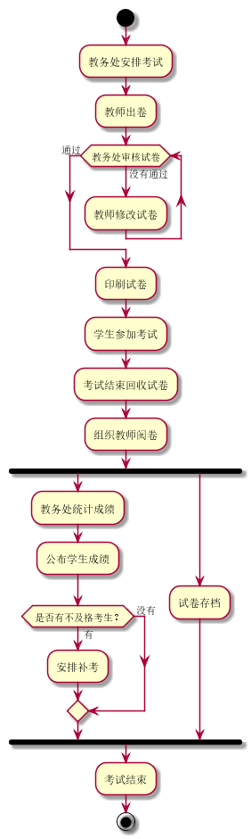
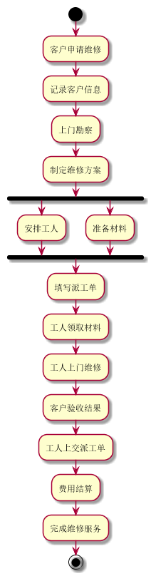

实验1：业务流程建模
======
| 学号 | 班级 | 姓名 | 照片 |
| ---- | ---  | ---- | ---- |
| 201510414121 | 1班  |  温云天   |  |

流程图1：考试及成绩管理流程
-----
### PlantUML源码如下：
```
@startuml
start
:教务处安排考试;
:教师出卷;
while (教务处审核试卷) is (没有通过)
  :教师修改试卷;
endwhile (通过)
:印刷试卷;
:学生参加考试;
:考试结束回收试卷;
:组织教师阅卷;
fork
  :教务处统计成绩;
  :公布学生成绩;
  if( 是否有不及格考生？) then( 有 )
    :安排补考;
  else( 没有 )
  endif
fork again
  :试卷存档;
endfork
:考试结束;
stop
@enduml
```
### 业务路程图如下：


流程图2：客户维修服务流程
-----
### PlantUML源码如下：
```
@startuml
start
:客户申请维修;
:记录客户信息;
:上门勘察;
:制定维修方案;
fork
  :安排工人;
fork again
:准备材料;
endfork
:填写派工单;
:工人领取材料;
:工人上门维修;
:客户验收结果;
:工人上交派工单;
:费用结算;
:完成维修服务;
stop
@enduml
```
### 业务路程图如下：
