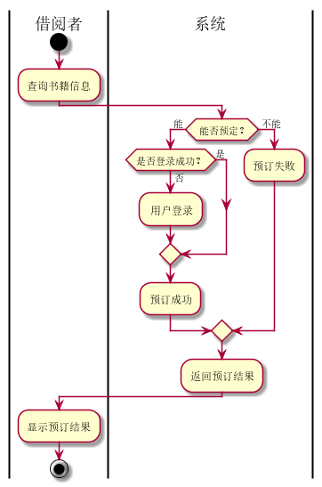
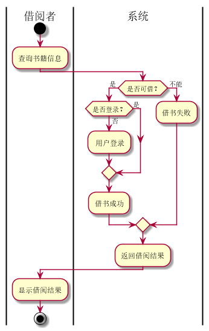
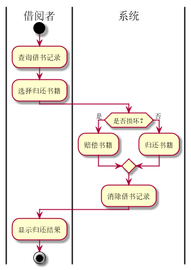
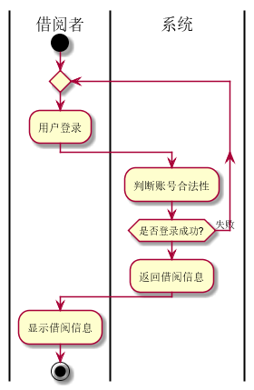

实验2：图书管理系统用例建模
======
| 学号 | 班级 | 姓名 | 照片 |
| ---- | ---  | ---- | ---- |
| 201510414121 | 1班  |  温云天   |  |

1.图书管理系统的用例关系图
-----
### 1.1 用例图PlantUML源码如下：
```
@startuml

left to right direction
skinparam packageStyle rectangle

:管理员: as administrator 
:游客: as tourist 
:借阅者: as borrower 

rectangle 图书管理借阅系统 {
  administrator --> (图书管理)
  administrator --> (借阅管理)
  
  borrower --> (借阅书籍)
  borrower --> (归还书籍)
  borrower -> (取消预订)
  borrower -> (预订书籍)
  borrower -> (查询借阅情况)
  tourist -> (查询书籍)
  
  (取消预订) .> (预订书籍) : extends
  (借阅书籍) .> (归还书籍) : extends

  (图书管理) <.. (新增书籍) : include
  (图书管理) <.. (删除书籍) : include
  (图书管理) <.. (修改书籍) : include
  tourist <|- borrower
}

@enduml
```
### 1.2. 用例图如下：


2.参与者说明：
### 2.1 图书管理员
主要职责是：书籍管理、借阅管理
### 2.2 借阅者
主要职责是：借阅书籍、查询书籍、归还书籍、预订书籍、取消预订、查询借阅情况
### 2.3 游客
主要职责是：查询书籍

3.用例规约表
-----
### 3.1 “书籍查询”用例
#### 3.11 用例规约
| 用例名称 | 书籍查询 | 
| ---- | ----  | 
| 参与者 | 借阅人 |
| 前置条件 | 系统正常运行 |
| 后置条件 | 查询到相应的书籍信息 |
| 主事件流  |
| 参与者动作 | 系统行为 |
| 1.借阅者输入要查询书籍信息<br><br><br>4.退出查询页面 | 2.系统根据信息查找书籍<br>3.系统返回查询结果 |
| 备选事件流 |  |
| 1a.用户没有输入查询内容<br>&nbsp;&nbsp;&nbsp;&nbsp;&nbsp;1.提示用户输入查询内容<br>2a.没有查到对应书籍信息<br>&nbsp;&nbsp;&nbsp;&nbsp;&nbsp;1.提示没有查到对应书籍信息|
| 业务规则  |
| 1.根据用户输入的信息可匹配多本书籍 |
#### 3.12 流程图源码
```
@startuml
|借阅者|
start
:输入查询书籍;
	|系统|
	:查询数据库;
:返回借阅信息;
|借阅者|
:得到书籍信息;

stop
@enduml
```
#### 3.13 流程图


### 3.2 “预定书籍”用例
#### 3.21 用例规约
| 用例名称 | 预定书籍 | 
| ---- | ----  | 
| 参与者 | 借阅人 |
| 前置条件 | 借阅者已经登录 |
| 后置条件 | 产生该书籍的预订信息，并更新书籍数量 |
| 主事件流  |
| 参与者动作 | 系统行为 |
| 1.输入账号密码，登录系统<br><br>3.选择要预订的书籍 | <br>2.进入书籍预订页面<br><br><br>4.记录预订信息，更新该书籍的数量<br>5.返回预订成功提示 |
| 备选事件流 |  |
| 1a.用户名或密码错误<br>&nbsp;&nbsp;&nbsp;&nbsp;&nbsp;1.提示登录失败，重新登录<br>2a.预订的书籍库存不足<br>&nbsp;&nbsp;&nbsp;&nbsp;&nbsp;1.提示库存不足，预订失败|
| 业务规则  |
| 1.每人每次最多只能预订一本书籍<br>2.预订的书籍三天之内有效 |
#### 3.22 流程图源码
```
@startuml
|借阅者|
start
:查询书籍信息;
	|系统|
	if( 能否预定？) then( 能 )
        if(是否登录成功？) then(否)
        : 用户登录;
        else(是)
        endif
    :预订成功;
    else( 不能 )
    :预订失败;
    endif
:返回预订结果;
|借阅者|
:显示预订结果;

stop
@enduml
```
#### 3.23 流程图


### 3.3 “借出书籍”用例
#### 3.31 用例规约
| 用例名称 | 借出书籍 | 
| ---- | ----  | 
| 参与者 | 借阅人 |
| 前置条件 | 借阅者已经登录 |
| 后置条件 | 产生该书籍的借阅信息，并更新书籍数量 |
| 主事件流  |
| 参与者动作 | 系统行为 |
| 1.输入账号密码，登录系统<br><br>3.选择要借阅的书籍 | <br>2.进入书籍借阅页面<br><br><br>4.记录借阅信息，更新该书籍的数量<br>5.返回借阅成功提示 |
| 备选事件流 |  |
| 1a.用户名或密码错误<br>&nbsp;&nbsp;&nbsp;&nbsp;&nbsp;1.提示登录失败，重新登录<br>2a.借阅的书籍库存不足<br>&nbsp;&nbsp;&nbsp;&nbsp;&nbsp;1.提示库存不足，借阅书籍失败|
| 业务规则  |
| 1.每人每次最多能借3本书<br>2.借书期限为1个月<br>3.损坏书籍5倍价格赔偿或赔偿相同正版书籍 |
#### 3.32 流程图源码
```
@startuml
|借阅者|
start
:查询书籍信息;
	|系统|
	if( 是否可借？) then( 是 )
        if(是否登录？) then(否)
        : 用户登录;
        else(是)
        endif
    :借书成功;
    else( 不能 )
    :借书失败;
    endif
:返回借阅结果;
|借阅者|
:显示借阅结果;

stop
@enduml
```
#### 3.33 流程图


### 3.4 “归还书籍”用例
#### 3.41 用例规约
| 用例名称 | 归还书籍 | 
| ---- | ----  | 
| 参与者 | 借阅人 |
| 前置条件 | 借阅者已经登录 |
| 后置条件 | 清除借阅记录，并更新书籍数量 |
| 主事件流  |
| 参与者动作 | 系统行为 |
| 1.输入账号密码，登录系统<br><br>3.选择要归还的书籍 | <br>2.进入书籍归还页面<br><br><br>4.清除借阅记录，更新该书籍的数量<br>5.返回还书成功提示 |
| 备选事件流 |  |
| 1a.用户名或密码错误<br>&nbsp;&nbsp;&nbsp;&nbsp;&nbsp;1.提示登录失败，重新登录<br>2a.归还书籍有损坏<br>&nbsp;&nbsp;&nbsp;&nbsp;&nbsp;1.按业务规则赔偿书籍|
| 业务规则  |
| 1.每人每次最多能借3本书<br>2.借书期限为1个月<br>3.损坏书籍5倍价格赔偿或赔偿相同正版书籍 |
#### 3.42 流程图源码
@startuml
|借阅者|
start
:查询借书记录;
:选择归还书籍;
	|系统|
	if( 是否损坏？) then( 是 )
    :赔偿书籍;
    else( 否 )
    :归还书籍;
    endif
:消除借书记录;
|借阅者|
:显示归还结果;

stop
@enduml
#### 3.43 流程图


### 3.5 “查询借阅情况”用例
#### 3.51 用例规约
| 用例名称 | 查询借阅情况 | 
| ---- | ----  | 
| 参与者 | 借阅人 |
| 前置条件 | 借阅者已经登录 |
| 后置条件 | 返回借阅者借书记录 |
| 主事件流  |
| 参与者动作 | 系统行为 |
| 1.输入账号密码，登录系统<br>2.点击借阅记录，查询借阅情况 | <br><br>3.根据用户id查询借阅记录<br>4.返回借阅者借阅记录 |
| 备选事件流 |  |
| 1a.用户名或密码错误<br>&nbsp;&nbsp;&nbsp;&nbsp;&nbsp;1.提示登录失败，重新登录<br>2a.没有借阅记录<br>&nbsp;&nbsp;&nbsp;&nbsp;&nbsp;1.提示没有借阅记录|
#### 3.52 流程图源码
@startuml
|借阅者|
start
repeat
:用户登录;
	|系统|
	:查询数据库;
repeat while (是否登录成功?) is (失败)
:返回借阅信息;
|借阅者|
:显示借阅信息;

stop
@enduml
#### 3.53 流程图
