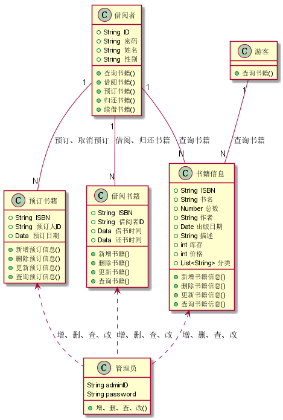
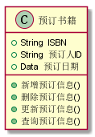
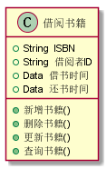
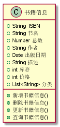
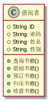
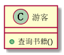
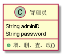

实验3：图书管理系统领域对象建模
======
| 学号 | 班级 | 姓名 | 照片 |
| ---- | ---  | ---- | ---- |
| 201510414121 | 1班  |  温云天   |  |

1.图书管理系统类图
-----
### 1.1 类图PlantUML源码如下：
```
@startuml
class 预订书籍{
    +String  ISBN
    +String  预订人ID
    +Data  预订日期
    +新增预订信息()
    +删除预订信息()
    +更新预订信息()
    +查询预订信息()
}
class 借阅书籍{
    +String  ISBN
    +String  借阅者ID
    +Data  借书时间
    +Data  还书时间
    +新增书籍()
    +删除书籍()
    +更新书籍()
    +查询书籍()
}

class 借阅者{
    +String  ID
    +String  密码
    +String  姓名
    +String  性别
    +查询书籍()
    +借阅书籍()
    +预订书籍()
    +归还书籍()
    +续借书籍()
}
class 游客{
    +查询书籍()
}
class 书籍信息{
    +String  ISBN
    +String 书名
    +Number 总数
    +String 作者
    +Date 出版日期
    +String 描述
    +int 库存
    +int 价格
    +List<String> 分类
    +新增书籍信息()
    +删除书籍信息()
    +更新书籍信息()
    +查询书籍信息()
}
class 管理员{
    String adminID
    String password
    +增、删、查、改()
}

游客"1" -- "N"书籍信息:查询书籍
借阅者"1" -- "N"书籍信息:查询书籍
借阅者"1" -- "N"预订书籍:预订、取消预订
借阅者"1" -- "N"借阅书籍:借阅、归还书籍
书籍信息 <.. 管理员:增、删、查、改
预订书籍 <.. 管理员:增、删、查、改
借阅书籍  <.. 管理员:增、删、查、改
@enduml
```
### 1.2 类图如下：


2.图书管理系统的对象图
### 2.1 预订书籍类
```
class 预订书籍{
    +String  ISBN
    +String  预订人ID
    +Data  预订日期
    +新增预订信息()
    +删除预订信息()
    +更新预订信息()
    +查询预订信息()
}
```


### 2.2 借阅书籍类
```
class 借阅书籍{
    +String  ISBN
    +String  借阅者ID
    +Data  借书时间
    +Data  还书时间
    +新增书籍()
    +删除书籍()
    +更新书籍()
    +查询书籍()
}
```


### 2.3 书籍信息类
```
class 书籍信息{
    +String  ISBN
    +String 书名
    +Number 总数
    +String 作者
    +Date 出版日期
    +String 描述
    +int 库存
    +int 价格
    +List<String> 分类
    +新增书籍信息()
    +删除书籍信息()
    +更新书籍信息()
    +查询书籍信息()
}
```


### 2.4 借阅者类
```
class 借阅者{
    +String  ID
    +String  密码
    +String  姓名
    +String  性别
    +查询书籍()
    +借阅书籍()
    +预订书籍()
    +归还书籍()
    +续借书籍()
}
```


### 2.5 游客类
```
class 游客{
    +查询书籍()
}
```


### 2.6 管理员类
```
class 管理员{
    String adminID
    String password
    +增、删、查、改()
}
```

