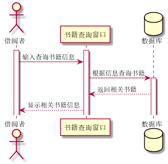
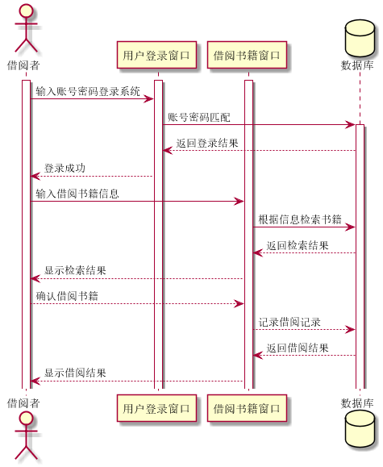
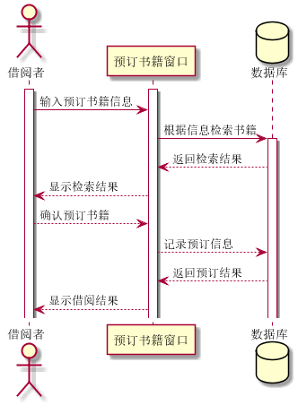
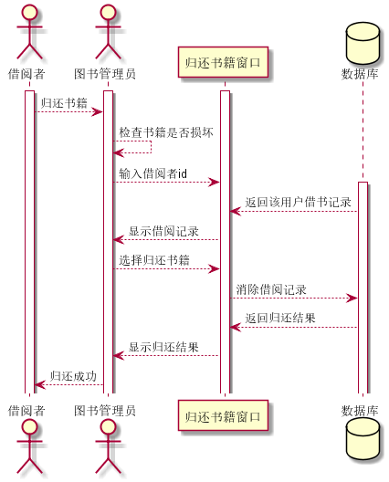
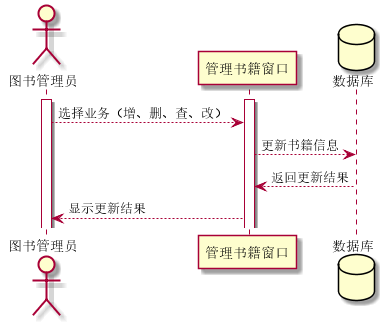

实验4：图书管理系统顺序图绘制
======
| 学号 | 班级 | 姓名 | 照片 |
| ---- | ---  | ---- | ---- |
| 201510414121 | 1班  |  温云天   |  |

1.查询图书用例
-----
### 1.1查询书籍用例plantUML源码
```
@startuml 查询书籍
actor 借阅者
activate 借阅者
activate 书籍查询窗口
借阅者 -> 书籍查询窗口: 输入查询书籍信息
database 数据库
书籍查询窗口 -> 数据库: 根据信息查询书籍
activate 数据库
数据库 --> 书籍查询窗口: 返回相关书籍
书籍查询窗口 --> 借阅者: 显示相关书籍信息
@enduml
```
### 1.2查询书籍用例顺序图

### 1.3查询书籍用例顺序图说明
a.借阅者通过书籍查询窗口输入书籍信息（名字、作者等）
b.根据用户输入在数据库中进行模糊查询，返回匹配的书籍列表
c.查询到的书籍列表再通过书籍查询窗口返回给借阅者

2.借阅书籍用例
-----
### 2.1借阅书籍用例plantUML源码
```
@startuml 借阅书籍
actor 借阅者

activate 借阅者
activate 用户登录窗口
activate 借阅书籍窗口
database 数据库
借阅者 -> 用户登录窗口: 输入账号密码登录系统
用户登录窗口 -> 数据库: 账号密码匹配
activate 数据库
数据库 --> 用户登录窗口: 返回登录结果
用户登录窗口 --> 借阅者: 登录成功

借阅者 -> 借阅书籍窗口: 输入借阅书籍信息
借阅书籍窗口 -> 数据库: 根据信息检索书籍
数据库 --> 借阅书籍窗口: 返回检索结果
借阅书籍窗口 --> 借阅者: 显示检索结果

借阅者 --> 借阅书籍窗口: 确认借阅书籍
借阅书籍窗口 --> 数据库: 记录借阅信息
数据库 --> 借阅书籍窗口: 返回借阅结果
借阅书籍窗口 --> 借阅者: 显示借阅结果
@enduml
```
### 2.2查询书籍用例顺序图

### 2.3查询书籍用例顺序图说明
a.借阅功能只对登录用户开发，即用户在借阅书籍之前必须先到登录页面登录
b.根据借阅者输入的账号密码在数据库相应表中匹配，在返回相应的登录结果
c.借阅者登录成功后可转到书籍借阅页面借阅书籍
d.数据库记录借阅者借阅记录，并返回相应的借阅结果

3.预订书籍用例
-----
### 3.1预订书籍用例plantUML源码
```
@startuml 预订书籍
actor 借阅者

activate 借阅者
activate 预订书籍窗口
database 数据库

借阅者 -> 预订书籍窗口: 输入预订书籍信息
预订书籍窗口 -> 数据库: 根据信息检索书籍

activate 数据库
数据库 --> 预订书籍窗口: 返回检索结果
预订书籍窗口 --> 借阅者: 显示检索结果
借阅者 --> 预订书籍窗口: 确认预订书籍
预订书籍窗口 --> 数据库: 记录预订信息
数据库 --> 预订书籍窗口: 返回预订结果
预订书籍窗口 --> 借阅者: 显示借阅结果
@enduml
```
### 3.2预订书籍用例顺序图

### 3.3预订书籍用例顺序图说明
a.预订书籍功能只对登录用户开发，即用户在借阅书籍之前必须先到登录页面登录，登录行为如查询书籍用例，不再赘述
b.借阅者输入预订书籍信息，查询该书籍是否可预订
c.数据库根据用户输入返回对应的数据列表
d.用户查看书籍详情，确认预订书籍
e.将借阅者预订书籍记录到数据库

4.归还书籍用例
-----
### 4.1归还书籍用例plantUML源码
```
@startuml 归还书籍
actor 借阅者
actor 图书管理员

activate 借阅者
activate 图书管理员
activate 归还书籍窗口
database 数据库

借阅者 --> 图书管理员: 归还书籍
图书管理员 --> 图书管理员: 检查书籍是否损坏
图书管理员 --> 归还书籍窗口: 输入借阅者id

activate 数据库
数据库 --> 归还书籍窗口: 返回该用户借书记录
归还书籍窗口 --> 图书管理员: 显示借阅记录
图书管理员 --> 归还书籍窗口: 选择归还书籍
归还书籍窗口 --> 数据库: 消除借阅记录
数据库 --> 归还书籍窗口: 返回归还结果
归还书籍窗口 --> 图书管理员: 显示归还结果
图书管理员 --> 借阅者: 归还成功
@enduml
```
### 4.2归还书籍用例顺序图

### 4.3归还书籍用例顺序图说明
a.归还书籍功能只对登录用户开发，即用户在归还书籍之前必须先到登录页面登录，登录行为如查询书籍用例，不再赘述
b.借阅者将书籍交给图书管理员，由图书管理员检查书籍是否损坏，如损坏进入赔偿流程，否则正常归还流程
c.图书管理员输入借阅者id，选择归还书籍
d.数据库消除用户的借阅记录，并返回归还结果
e.图书管理员通知还书者还书结果

5.管理书籍用例
-----
### 5.1管理书籍用例plantUML源码
```
@startuml 管理书籍
actor 图书管理员

activate 图书管理员
activate 管理书籍窗口
database 数据库

图书管理员 --> 管理书籍窗口: 选择业务（增、删、查、改）
管理书籍窗口 --> 数据库: 更新书籍信息
数据库 --> 管理书籍窗口: 返回更新结果
管理书籍窗口 --> 图书管理员: 显示更新结果

@enduml
```
### 5.2归还书籍用例顺序图

### 5.3归还书籍用例顺序图说明
a.归还书籍功能只对登录用户开发，即用户在归还书籍之前必须先到登录页面登录，登录行为如查询书籍用例，不再赘述
b.图书管理员在管理书籍窗口选择管理业务，并录入相关信息
c.数据库更新书籍信息