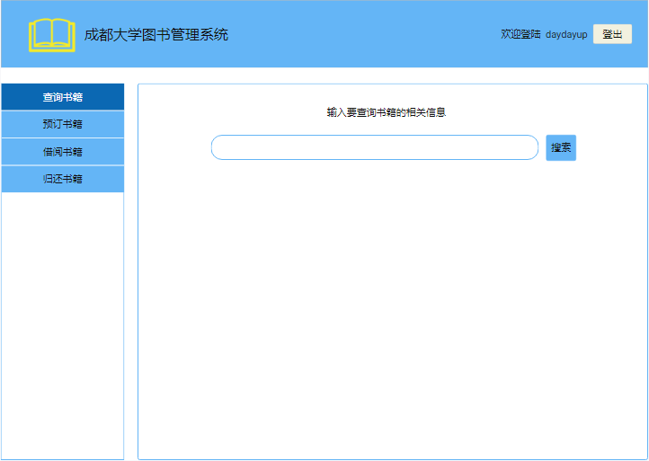
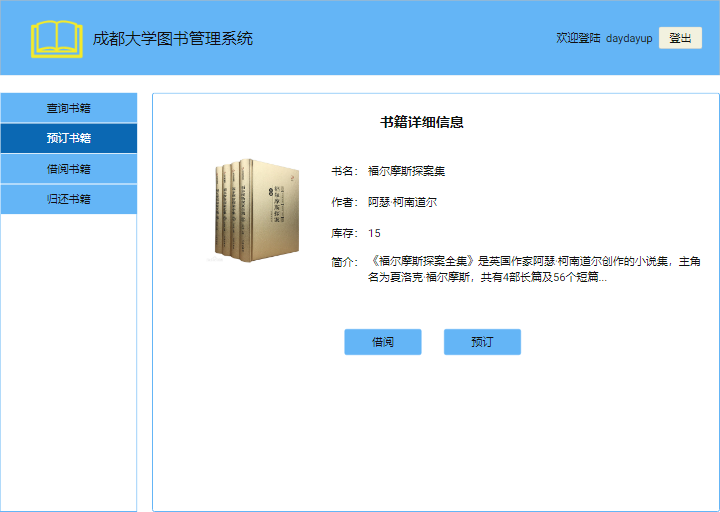

实验4：图书管理系统数据库设计与界面设计
======
| 学号 | 班级 | 姓名 | 照片 |
| ---- | ---  | ---- | ---- |
| 201510414121 | 1班  |  温云天   |  |

1.数据库表设计
-----
### 1.1 书籍表
| 字段 | 类型 | 主键，外键 | 可以为空 | 默认值 | 约束 | 说明 |
| :-: | :-: | :-: | :-: | :-: | :-: | :-: |
| ISBN | varchar(40) | 主键 | 否 |  |  | 国际标准书号(唯一) |
| bookName | varchar(80) |  | 否 |  |  | 书名 |
| number | int |  | 否 |  |  | 库存 |
| author | varchar(20) |  | 否 |  |  | 作者 |
| publishDate | Date |  | 否 |  |  | 出版日期 |
| describe | varchar(200) |  | 否 |  |  | 简介 |
| price | float |  | 否 |  |  | 价格 |
| category | varchar(80) |  | 否 |  |  | 分类 |

### 1.2 借阅者表
| 字段 | 类型 | 主键，外键 | 可以为空 | 默认值 | 约束 | 说明 |
| :-: | :-: | :-: | :-: | :-: | :-: | :-: |
| userID | int | 主键 | 否 |  |  | 用户ID(学生学号) |
| password | varchar(20) |  | 否 |  |  | 密码 |
| name | varchar(20) |  | 否 |  |  | 实名 |
| sex | char(2) |  | 否 |  |  | 性别 |

### 1.3 管理员表
| 字段 | 类型 | 主键，外键 | 可以为空 | 默认值 | 约束 | 说明 |
| :-: | :-: | :-: | :-: | :-: | :-: | :-: |
| userID | int | 主键 | 否 |  |  | 账号 |
| password | varchar(20) |  | 否 |  |  | 密码 |
| name | varchar(20) |  | 否 |  |  | 实名 |

### 1.4 预订书籍表
| 字段 | 类型 | 主键，外键 | 可以为空 | 默认值 | 约束 | 说明 |
| :-: | :-: | :-: | :-: | :-: | :-: | :-: |
| id | varchar(40) | 主键 | 否 |  |  | 预订书籍表主键 |
| ISBN | varchar(80) | 外键 | 否 |  |  | 预订书籍书号 |
| readerID | int | 外键 | 否 |  |  | 预订者ID |

### 1.4 借阅书籍表
| 字段 | 类型 | 主键，外键 | 可以为空 | 默认值 | 约束 | 说明 |
| :-: | :-: | :-: | :-: | :-: | :-: | :-: |
| id | varchar(40) | 主键 | 否 |  |  | 借阅书籍表主键 |
| ISBN | varchar(80) | 外键 | 否 |  |  | 预订书籍书号 |
| readerID | int | 外键 | 否 |  |  | 预订者ID |
| lendTime | Date |  | 否 |  |  | 借书时间 |
| returnTime | Date |  | 是 |  |  | 还书时间 |

2.界面设计
-----
### 2.1查询书籍界面设计

+   用例图参见：查询书籍设计用例
+   类图参见：书籍类
+   顺序图参见：查询书籍设计顺序图
+   API接口如下：
1. 书籍查询API
    +   功能：书籍查询
    +   请求地址：http://localhost:8080/bookManage/api/find_book
    +   请求方法：get
    +   请求参数：

    | 参数名称 | 必填 | 说明 | 
    | :-: | :-:  | :-: | 
    | book_infor | 是  |  要查询书籍的相关信息(模糊书名、作者)   | 
    +   返回实例
    ```json
    [
        {
            "name": "福尔摩斯探案集",
            "author": "阿瑟·柯南道尔",
            "number": 5,
            "describe": "《福尔摩斯探案全集》是英国作家阿瑟·柯南道尔创作的小说集，主角名为夏洛克·福尔摩斯，共有4部长篇及56个短篇。"
        }
    ]
    ```
    +   返回实例说明

    | 参数名称 | 说明 | 
    | :-: | :-: | 
    | name  |  书名   | 
    | author  |  作者   | 
    | number  |  库存   | 
    | describe  |  书籍简介   | 

### 2.2预订书籍界面设计

+   用例图参见：预订书籍设计用例
+   类图参见：预订书籍类
+   顺序图参见：预订书籍设计顺序图
+   API接口如下：
1. 预订书籍API
    +   功能：预定书籍
    +   请求地址：http://localhost:8080/bookManage/api/order_book
    +   请求方法：get
    +   请求参数：

    | 参数名称 | 必填 | 说明 | 
    | :-: | :-:  | :-: | 
    | ISBN | 是  |  要预订书籍的书号   | 
    +   返回实例
    ```json
    {
        "status": 1000,
        "infor": "预订成功"
    }
    ```
    +   返回实例说明

    | 参数名称 | 说明 | 
    | :-: | :-: | 
    | status  |  操作状态码   | 
    | status  |  操作返回信息   | 

2. 借阅书籍API
    +   功能：预定书籍
    +   请求地址：http://localhost:8080/bookManage/api/lend_book
    +   请求方法：get
    +   请求参数：

    | 参数名称 | 必填 | 说明 | 
    | :-: | :-:  | :-: | 
    | ISBN | 是  |  要借阅书籍的书号   | 
    +   返回实例
    ```json
    {
        "status": 1000,
        "infor": "借阅成功"
    }
    ```
    +   返回实例说明

    | 参数名称 | 说明 | 
    | :-: | :-: | 
    | status  |  操作状态码   | 
    | status  |  操作返回信息   | 