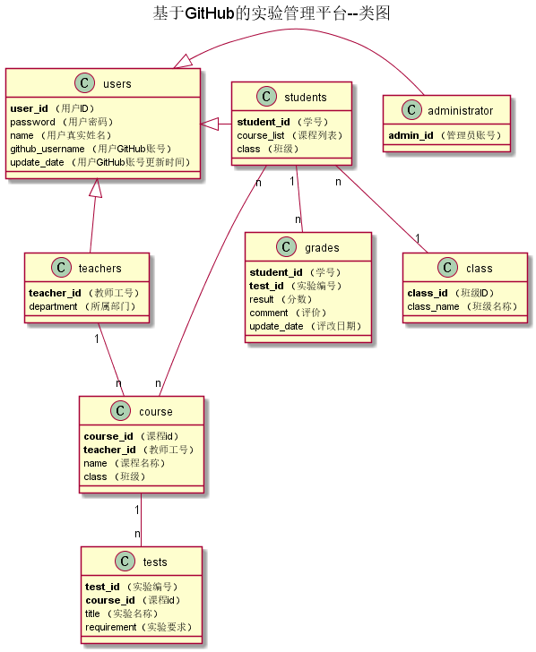

<!-- markdownlint-disable MD033-->
<!-- 禁止MD033类型的警告 https://www.npmjs.com/package/markdownlint -->

# 基于GitHub的实验管理平台的分析与设计

### 成都大学信息科学与工程学院

|学号|班级|姓名|照片|
|:-------:|:-------------: | :----------:|:---:|
|201510414121|15软件工程1班|温云天||

## 1. 概述
- 基于GitHub的实验管理平台的作用是在线管理实验成绩的Web应用系统。学生和老师的实验内容均存放在github
页面上。
- 老师和学生都能通过本系统的链接方便地跳转到学生的每个GitHUB实验目录，以便批改实验或者查看实验情况。
- 实验成绩按数字分数计算，每项实验的满分为100分，最低为0分。
- 系统自动计算每个学生的所有实验的平均分。
- 学生的功能主要包括：
    1. 登录系统
    2. 账号密码管理
    3. 上传实验（上传到github）
    4. 成绩查询 
- 老师的功能主要包括：
    1. 登录系统
    2. 账号密码管理
    3. 批改作业
    4. 录入、修改、查询成绩
    5. 班级学生管理
- 管理员的功能主要包括：
    1. 系统维护
    2. 班级、学生、课程信息维护
    3. 教师账号管理
    
## 2. 系统总体结构

界面设计参见：[系统分析与设计](https://wenyuntian.github.io/is_analysis/test6/UI/#screen=sBABA279CFC1528100407504)
    
## 3. 用例图设计 [源码](src/useCase.puml)

## 4. 类图设计 [源码](src/class.puml)

## 5. 数据库设计
- ### [参见数据库设计](./数据库设计.md)

## 6. 用例及界面详细设计
- ### ["登录"用例](./用例/登录用例.md)，[界面](https://wenyuntian.github.io/is_analysis/test6/UI/#screen=s1D4284C5361528102480626)
- ### [“登出”用例](./用例/登出用例.md)，[界面](https://wenyuntian.github.io/is_analysis/test6/UI/#screen=sBABA279CFC1528100407504)
- ### [“创建课程”用例](./用例/创建课程用例.md)，[界面](https://wenyuntian.github.io/is_analysis/test6/UI/#screen=s995E2F50161528112141198)
- ### [“班级管理”用例](./用例/班级学生管理.md)，[界面](https://wenyuntian.github.io/is_analysis/test6/UI/#screen=s363352A1991528119951225)
- ### [“发布实验”用例](./用例/发布作业用例.md)，[界面](https://wenyuntian.github.io/is_analysis/test6/UI/#screen=s166827F3A31528120949553)
- ### [“查看作业”用例](./用例/查看作业.md)，[界面](https://wenyuntian.github.io/is_analysis/test6/UI/#screen=s422ACC944B1528109056765)
- ### [“录入成绩”用例](./用例/录入成绩.md)，[界面](https://wenyuntian.github.io/is_analysis/test6/UI/#screen=sF2122445A71528110829414)
- ### [“修改成绩”用例](./用例/修改成绩.md)，[界面](https://wenyuntian.github.io/is_analysis/test6/UI/#screen=sF2122445A71528110829414)
- ### [“成绩查询”用例](./用例/成绩查询用例.md)，[界面](https://wenyuntian.github.io/is_analysis/test6/UI/#screen=s54831E84E91528107764483)
- ### [“修改个人信息”用例](./用例/修改个人信息.md)，[界面](https://wenyuntian.github.io/is_analysis/test6/UI/#screen=s6285ACACFA1528108323236)
- ### [“查看个人信息”用例](./用例/查询个人信息.md)，[界面](https://wenyuntian.github.io/is_analysis/test6/UI/#screen=s6285ACACFA1528108323236)
- ### [“教师账号管理”用例](./用例/教师账号管理.md)，[界面](https://wenyuntian.github.io/is_analysis/test6/UI/#screen=s45A4FB5CD71528122711874)
- ### [“修改密码”用例](./用例/修改密码.md)，[界面](https://wenyuntian.github.io/is_analysis/test6/UI/#screen=s263F26B2711528108379620)
- ### [“学生信息导入”用例](./用例/学生信息导入.md)
    