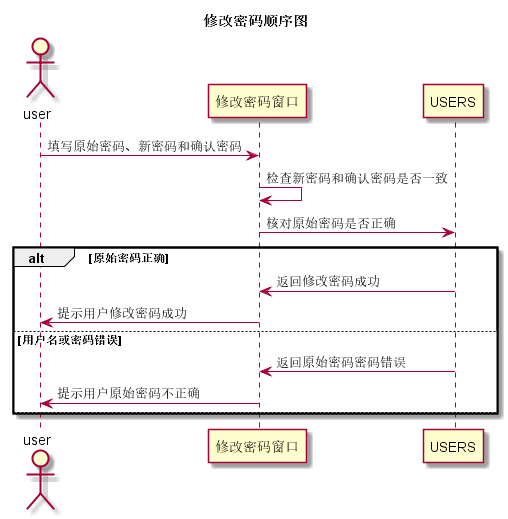

# “修改密码”用例 [返回](../README.md)

## 1. 用例规约

|用例名称| 修改密码 |
|-------|:-------------|
|功能| 修改密码 |
|参与者| 教师、学生 |
|前置条件| 教师或学生已经登录 |
|后置条件| 输入正确的原始密码，且密码和确认密码相同 |
|主事件流| 1. 更新数据库USERS表中的password字段 |
|备选事件流|1a. 原始密码不正确  &nbsp;&nbsp; 1.提示用户原始密码不正确  &nbsp;&nbsp; 2.用户再次输入原始密码  2a. 确认密码和新密码不相同  &nbsp;&nbsp; 1.提示用户确认密码和新密码必须相同  &nbsp;&nbsp; 2.确认密码和新密码|

## 2. 业务流程（顺序图）[源码](../src/修改密码.puml)

## 3. 界面设计
- 界面参照:[修改密码](https://wenyuntian.github.io/is_analysis/test6/UI/#screen=s263F26B2711528108379620)
- API接口调用
    - 接口1：[revisePassword](../接口/revisePassword.md)

## 4. 算法描述
    
## 5. 参照表

- [USERS](../数据库设计.md/#USERS)

