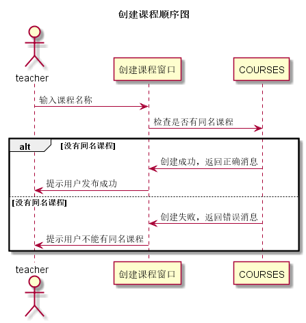

# “登出”用例 [返回](../README.md)

## 1. 用例规约

|用例名称|创建课程|
|-------|:-------------|
|功能| 已经登录的教师创建一门新的课程 |
|参与者| 教师 |
|前置条件| 教师已经登录 |
|后置条件| 创建一门课程 |
|主事件流| 1. 生成新课程信息，存储到数据库 |
|备选事件流|1a. 输入有误  &nbsp;&nbsp; 1.提示用户输入不合法   &nbsp;&nbsp; 2. 用户重新输入课程名称|

## 2. 业务流程（顺序图）[源码](../src/创建课程.puml)

## 3. 界面设计
- 界面参照: [创建课程](https://wenyuntian.github.io/is_analysis/test6/UI/#screen=s995E2F50161528112141198)
- API接口调用
    - 接口1：[createCourse](../接口/createCourse.md)

## 4. 算法描述
    
## 5. 参照表

- [COURSE](../数据库设计.md/#COURSE)

