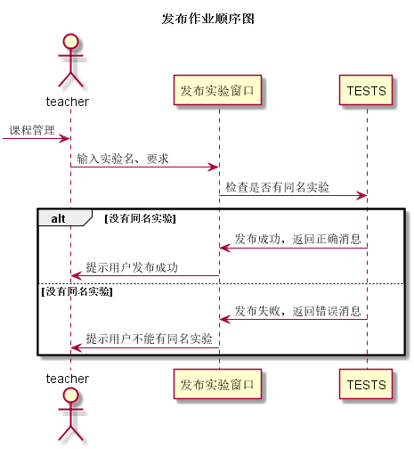

# “发布作业”用例 [返回](../README.md)

## 1. 用例规约

|用例名称| 发布作业 |
|-------|:-------------|
|功能| 发布课程作业 |
|参与者| 教师 |
|前置条件| 教师已经登录，创建课程成功且添加了待管理班级 |
|后置条件| 发布新的作业 |
|主事件流| 1. 输入实验名称   2. 输入实验要求 |
|备选事件流|1a. 输入实验名称错误  &nbsp;&nbsp; 1.提示用户输入错误  &nbsp;&nbsp; 2.用户重新输入   2a. 实验要求输入错误  &nbsp;&nbsp; 1.提示用户输入错误  &nbsp;&nbsp; 2.用户重新输入

## 2. 业务流程（顺序图）[源码](../src/发布作业.puml)

## 3. 界面设计
- 界面参照:[发布作业](https://wenyuntian.github.io/is_analysis/test6/UI/#screen=s166827F3A31528120949553)
- API接口调用
    - 接口1：[testPublish](../接口/testPublish.md)

## 4. 算法描述
    
## 5. 参照表

- [TESTS](../数据库设计.md/#TESTS)

