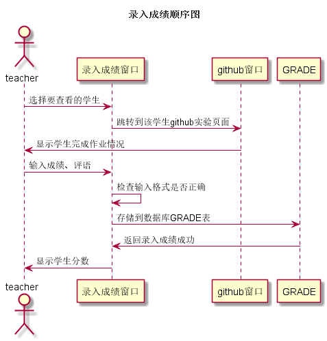

# “录入成绩”用例 [返回](../README.md)

## 1. 用例规约

|用例名称| 录入成绩 |
|-------|:-------------|
|功能| 录入学生实验成绩、录入实验评语 |
|参与者| 教师 |
|前置条件| 教师已经登录，创建课程成功，添加了待管理班级，作业已经发布 |
|后置条件| 录入学生实验成绩、录入实验评语 |
|主事件流| 1. 录入成绩、评语成功 |
|备选事件流|1a. 录入成绩不在0-100范围内  &nbsp;&nbsp; 1.提示用户输入正确成绩  &nbsp;&nbsp; 2.用户重新输入成绩  2a. 录入评语超过字数限制  &nbsp;&nbsp; 1.提示用户字数过多  &nbsp;&nbsp; 2.用户重新输入评语

## 2. 业务流程（顺序图）[源码](../src/录入成绩.puml)

## 3. 界面设计
- 界面参照: [录入成绩](https://wenyuntian.github.io/is_analysis/test6/UI/#screen=sF2122445A71528110829414)
- API接口调用
    - 接口1：[enterScore](../接口/enterScore.md)

## 4. 算法描述
    
## 5. 参照表

- [GRADE](../数据库设计.md/#GRADE)

