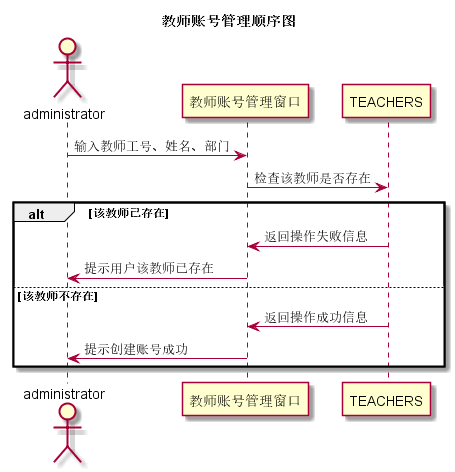

# “教师账号管理”用例 [返回](../README.md)

## 1. 用例规约

|用例名称| 教师账号管理 |
|-------|:-------------|
|功能| 添加、删除教师账号 |
|参与者| 系统管理员 |
|前置条件| 系统管理员已经登录 |
|后置条件| 管理员创建、删除教师账号 |
|主事件流| 1. 更新数据库TEACHERS表 |

## 2. 业务流程(顺序图)[源码](../src/教师账号管理.puml)

## 3. 界面设计
- 界面参照: [教师账号管理](https://wenyuntian.github.io/is_analysis/test6/UI/#screen=s45A4FB5CD71528122711874)
- API接口调用
    - 接口1：[manageTeacher](../接口/manageTeacher.md)

## 4. 算法描述
    
## 5. 参照表

- [TEACHERS](../数据库设计.md/#TEACHERS)

